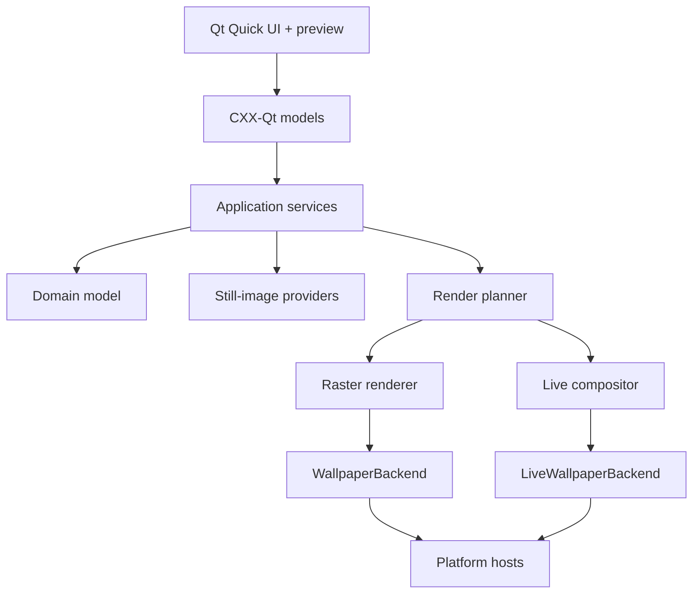

# Architecture

## Boundaries

Easel is organized around a platform-independent domain and renderer. Qt and operating-
system APIs are adapters at the edge.

## Coordinate spaces

Three coordinate spaces must never be conflated:

1. **Logical desktop space** describes compositor/window placement and fractional scaling.
2. **Native pixel space** describes the pixel dimensions of each final wallpaper output.
3. **Physical layout space** describes millimeters, bezels, view distance, and monitor angle.

Every display record contains all three. The renderer maps a composition from physical space
into one native-pixel image per output. A platform backend may combine those pieces into a
virtual-desktop image only if the desktop API requires it.

Stable display identity should prefer EDID-derived manufacturer, model, and serial values.
Connector names and geometry are fallbacks, never sole long-term identifiers.

## Core crate

`easel-core` owns versioned serializable types:

- displays and arrangements;
- still, animated-image, and video assets with licenses and attribution;
- wallpaper profiles and display groups;
- schedules, dynamic still sets (time / solar-position / appearance), and selection rules;
- presentation and playback policy;
- validation errors.

It has no Qt, HTTP, image-decoder, or OS dependency.

## Dynamic still packages

`easel-dynamic` imports Apple Dynamic Desktop HEIC (and Plasma-compatible packages): XMP
`apple_desktop` metadata, binary plist schedules, and per-frame decode via libheif. It also
plans per-display native re-encodes so physical spanning can ship one OS-hosted package per
output. See ADR 0006.

## Renderer

`easel-render` has two layers:

- a deterministic planner that converts a profile and arrangement into per-output operations;
- a raster executor using the Rust `image` ecosystem.

Planning is tested without reading files. Raster tests use small generated fixtures. Render jobs
write to a temporary file and atomically promote completed output so cancellation or crashes do
not leave a partial wallpaper.

The executor will implement orientation normalization, color-profile handling, decoding limits,
cover/contain scaling, focal-point cropping, composition, and projective transforms. Large work
must remain cancelable and run away from the Qt event thread.

For live media, the same plan describes each display's crop and transform. A generated poster
frame passes through the raster executor. The preferred fast path applies equivalent crop and
transform operations in the live compositor without round-tripping every decoded frame through
Rust-owned CPU memory.

## Presentation pipelines

Static and dynamic-still profiles use completed images:

1. choose a still asset from the profile or scheduler;
2. render atomic per-display or virtual-desktop output;
3. apply it through `WallpaperBackend`;
4. keep the last completed output if rendering or apply fails.

Animated images and video use a persistent runtime:

1. probe decoder and `LiveWallpaperBackend` capabilities;
2. render and apply a safe poster frame;
3. open one logical media timeline using Qt Multimedia where available;
4. present synchronized crops on platform-owned desktop surfaces;
5. pause or release resources in response to power and session state;
6. restore the poster frame if playback or hosting fails.

One playback clock must drive all displays in a group. Starting one unrelated player per monitor
is not acceptable because decode latency creates visible drift at bezels. Source audio is always
discarded. Hardware decoding is preferred but treated as a probed capability rather than a
portable guarantee.

## Library store

`easel-library` owns the local folder index, filesystem watching, SQLite asset/collection/
favorites/history persistence, and the HTTPS acquisition cache used when a remote still is opened
in Compose. Domain types remain in `easel-core`; this crate only adds IO, watching, and storage.

## Scheduler

`easel-scheduler` persists profiles, display groups, schedules, rotation queues, dynamic still
sets, and hotplug policy as versioned TOML, and stores rotation apply history plus last-applied
dynamic frame state in SQLite. Schedule evaluation, dynamic frame selection, avoid-repeat
selection, and hotplug resolution are pure functions in `easel-core` (injected clock / UTC
offset). The desktop poller and `easel` CLI share the same store; pause, skip, and status mutate
or read those documents. A native OS system tray icon is deferred until the desktop host uses Qt
Widgets/`QApplication` (Qt Labs Platform requirement).

## Image providers

`easel-providers` normalizes approved still-image sources into a common result while preserving
source-specific metadata. Provider adapters are not general plugins in the first release; they
are compiled integrations reviewed against current terms. Local media can be still, animated, or
video; online motion sources require a separate terms and licensing review before an adapter can
expose them.

Every provider declares a machine-readable policy disposition:

- allowed;
- requires written approval;
- prohibited;
- unknown/disabled.

The registry refuses to activate providers that are not allowed. See
`docs/IMAGE_PROVIDERS.md`.

## Platform backends

Backends report capabilities before mutation. `WallpaperBackend` applies completed still images.
Candidate Linux adapters include KDE Plasma via D-Bus/Plasma scripting, GNOME-family desktops via
settings APIs, XFCE via xfconf, and an explicit custom-command adapter. Windows uses the current
`IDesktopWallpaper` API for stills. macOS uses per-screen AppKit integration for stills.

`LiveWallpaperBackend` owns persistent desktop surfaces. KDE Plasma has the cleanest initial path:
a dedicated QML wallpaper plugin can draw the desktop background. Qt Multimedia provides decoding
and `VideoOutput`, but it does not replace the native host integration. The public Windows
`IDesktopWallpaper` and macOS `NSWorkspace.setDesktopImageURL` contracts set image files, not
video. Windows and macOS live hosts therefore remain feasibility-gated and must be labeled
experimental until their lifecycle, desktop-icon ordering, multi-desktop behavior, and OS-update
stability are validated. No undocumented host technique is represented as a supported API.

The core does not branch on environment strings. Backend probing and selection belong to the
platform layer and produce diagnostic evidence.

## Desktop application

Qt Quick Controls provides the cross-platform component set. CXX-Qt exposes narrow presentation
models and commands; QML does not own business state. Asynchronous Rust work returns to the Qt
thread through CXX-Qt's thread-safe queueing mechanism.

Qt Multimedia is the preferred decoder and application preview path for animated images and
video. Decoder availability is platform/package dependent, so the UI displays detected container,
codec, hardware-decode, and live-host capability before Apply is enabled.

Do not expose filesystem, network, or platform objects directly to QML.

## Persistence

- Human-readable, versioned TOML for profiles, display arrangements, schedules, and rotation queues.
- SQLite is reserved for indexed local/remote asset metadata, rotation history, and cache bookkeeping.
- OS credential storage holds provider secrets.
- Writes use temporary files plus atomic replacement.
- Schema migrations are forward-only and covered by fixtures.

## Security and privacy

- HTTPS-only provider traffic.
- Provider host allowlists and redirect validation.
- Decode size limits and cancellation for untrusted images.
- Local-media allowlists, decode-duration limits, and bounded poster extraction for untrusted
  animated images and video.
- No remote telemetry by default.
- Attribution events are sent only when a provider explicitly requires them and the operation
  is enabled under an approved integration.
- Diagnostic bundles redact tokens, home paths where practical, and remote query parameters.

## Primary platform references

- Qt media playback and rendering: https://doc.qt.io/qt-6/videooverview.html
- Qt Quick `MediaPlayer`: https://doc.qt.io/qt-6/qml-qtmultimedia-mediaplayer.html
- KDE Plasma wallpaper plugin development: https://develop.kde.org/docs/plasma/
- Windows `IDesktopWallpaper`: https://learn.microsoft.com/en-us/windows/win32/api/shobjidl_core/nn-shobjidl_core-idesktopwallpaper
- macOS per-screen still images: https://developer.apple.com/documentation/appkit/nsworkspace/setdesktopimageurl%28_%3Afor%3Aoptions%3A%29
