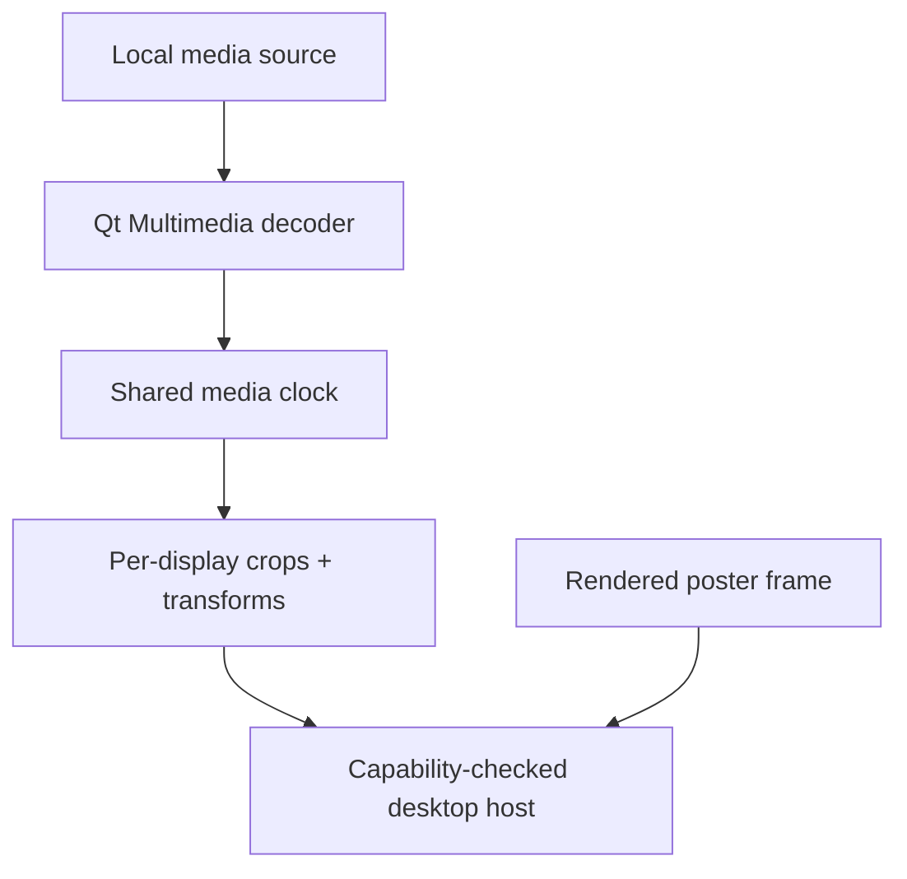

# Dynamic and live wallpaper plan

## Capability definitions

Easel uses precise terms in its code, interface, and support matrix:

| Capability | Behavior | Runtime requirement |
| --- | --- | --- |
| Static | One rendered still remains active until replaced. | Public still-wallpaper backend. |
| Dynamic stills | A schedule, solar rule, or time-of-day timeline atomically replaces still frames. | Scheduler plus public still-wallpaper backend. |
| Animated image | A GIF, animated WebP, or similar local container plays continuously. | Decoder, compositor, and persistent desktop surface. |
| Video | A silent local video plays continuously. | Video decoder, compositor, and persistent desktop surface. |

Native vendor dynamic wallpaper packages (Apple Dynamic Desktop HEIC, Plasma dynamic
HEIC/AVIF) are the preferred **interchange** format. Easel imports their schedule metadata
(`apple_desktop:solar` altitude/azimuth samples, `apr` appearance, `h24` time) into a portable
`DynamicStillSet`, retains the original package for provenance, and encodes per-display native
packages (crop every frame, then write Apple XMP HEIC) so physical spanning can be OS-hosted.
See ADR 0006.

## Feasibility assessment

Dynamic stills are feasible on any backend that can already apply a still image, and stronger
on platforms that can host a native dynamic package. Animated images and video remain a separate
live-host problem (Stage 6).

| Platform/session | Dynamic stills | Animated/video host | Initial position |
| --- | --- | --- | --- |
| KDE Plasma 6 | Appearance → built-in day/night (`org.kde.image` + KNightTime). Dense solar → Rust evaluation + still frames via Easel `Plasma/Wallpaper` plugin IPC (ADR 0007 + 0008); no zzag required. | Easel QML wallpaper plugin (`apps/easel-plasma-wallpaper`). | First supported live target. |
| Other Linux desktops | Static settings backend applies each frame. | Desktop/compositor-specific; no universal Wayland attachment. | Probe individually; poster fallback. |
| Windows | `IDesktopWallpaper` still-frame apply only (no public dynamic-HEIC API). | Public wallpaper API does not expose video playback. | Feasibility spike; experimental if safe. |
| macOS | Native Dynamic Desktop HEIC host (`native_dynamic_bundle`); System Events still apply as fallback. | Public `setDesktopImageURL` contract is still-image oriented. | Feasibility spike; experimental if safe. |

The application must never advertise a live capability based only on the operating-system name.
It probes the current session and decoder, reports evidence in diagnostics, and falls back to the
poster frame when no validated live host exists.

## Live session design

One logical player owns timing for a display group. Each output surface consumes the same frame
and applies its own crop and physical-layout transform. This preserves continuity across bezels
and avoids the drift caused by independent per-monitor players.

The session lifecycle is `prepare → poster → play ↔ pause → stop`. Prepare validates the local
source, decoder, poster, surfaces, and policy without removing the current wallpaper. Playback
starts only after every requested surface is ready. A partial multi-monitor start is a failure.

## Media and policy defaults

- Local files only for the initial motion implementation.
- Audio tracks are detected for diagnostics and always discarded.
- Loop playback and a 30 fps ceiling by default.
- Pause on battery and while a full-screen application is active by default.
- Pause on session lock and suspend; revalidate display topology and host surfaces on resume.
- Prefer hardware decoding when available, with measured software fallback rather than an
  unconditional guarantee.
- Extract or render a poster frame before Apply becomes available.
- Surface codec/container failures in the UI; do not silently transcode user media.

Streaming URLs are out of scope. They introduce network continuity, authentication, buffering,
cache, content changes, and provider-policy concerns that are independent of local playback.

## Delivery gates

A live backend moves from experimental to supported only after it demonstrates:

1. stable ownership below desktop icons across login, shell restart, workspace changes, and OS
   updates;
2. synchronized display crops within one presented frame;
3. bounded CPU, GPU, memory, and battery use on representative hardware;
4. correct pause/resume behavior for power, lock, sleep, and full-screen policy;
5. deterministic poster fallback after decoder, compositor, or host failure;
6. clear diagnostics for unavailable codecs and hardware acceleration.

## Primary references

- Qt Multimedia video overview: https://doc.qt.io/qt-6/videooverview.html
- Qt Quick `MediaPlayer`: https://doc.qt.io/qt-6/qml-qtmultimedia-mediaplayer.html
- KDE Plasma extension development: https://develop.kde.org/docs/plasma/
- Windows `IDesktopWallpaper`: https://learn.microsoft.com/en-us/windows/win32/api/shobjidl_core/nn-shobjidl_core-idesktopwallpaper
- Windows `SetWallpaper`: https://learn.microsoft.com/en-us/windows/win32/api/shobjidl_core/nf-shobjidl_core-idesktopwallpaper-setwallpaper
- macOS `setDesktopImageURL`: https://developer.apple.com/documentation/appkit/nsworkspace/setdesktopimageurl%28_%3Afor%3Aoptions%3A%29
